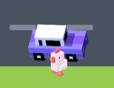
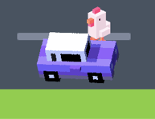

# Cross The Road

These steps are available at [bit.ly/cross-the-road-steps](https://bit.ly/cross-the-road-steps).

<section markdown="1">

---

## 🔄 Step 1: Remix the Starter Pack

Follow the link: [bit.ly/cross-the-road-starter](https://bit.ly/cross-the-road).

Next tap **Remix**. When the project loads, give it a new name. Have a look around the project.

</section>
<section markdown="1">

* *What sprites do you have available?*
* *What costumes do the sprites have?*
* *What sounds are available?*
* *What backgrounds do you have?*
* *Is there any code already?*

---

</section>
<section markdown="1">

## 🐔 Step 2: Position the player at the bottom of the screen

When the game starts, we want to position the player at the bottom of the screen, in the middle. Add this code to the player sprite.

```scratch
when green flag clicked
go to x: [0] y: [-160]
```

</section>
<section markdown="1">

* *Can you position the player at the top of the screen instead?*

---

</section>
<section markdown="1">

## 🚶‍➡️ Step 3: Make the player walk to the right

Add a forever loop and inside check to see if the right arrow is being pressed. If it is, move the player to the right. 

```scratch
when green flag clicked
go to x: [0] y: [-160]
forever
    if <key (right arrow v) pressed?> then
        change x by [5]
    end
end
```

</section>
<section markdown="1">

* *Can you make the player move faster or slower?*

---

</section>
<section markdown="1">

## ⬅️ ⬆️ ⬇️ Step 4: Make the player walk in the other directions

Now the player can walk right. Next let’s make them walk left, up and down. 

</section>
<section markdown="1">

* *When the player moves left, can you make them look to the left?*

---

</section>
<section markdown="1">

## 🚗 Step 5: Add a car

Instead of using the car sprite directly, we will clone it. That will let us have more than one car on the screen at the same time.

To do that, hide the sprite, then clone it and then when the clone is created, position it and show it. We’re going to put it on the left of the screen. Add this code to the car sprite.

```scratch
when green flag clicked
hide
create clone of (myself v)

when I start as a clone
go to x: [-240] y: [-110]
show
```

</section>
<section markdown="1">

* *Can you pick a different car image?*
* *Can you pick a random car image?*

---

</section>
<section markdown="1">

## 🚙 Step 6: Make the car move

Next we will make the car move from left to right across the screen. We will use repeat until for this. Once it gets across the screen, we can hide the clone.

```scratch
when I start as a clone
go to x: [-240] y: [-110]
show
repeat until <(x position) > (240)>
	change x by (5)
end
hide
```

</section>
<section markdown="1">

* *Can you make the car move faster or slower?*
* *Can you make the car move at a random speed?*
* *Can you make the car move in a different lane of the road?*
* *Can you make the car move in a random lane of the road?* **TRICKY** 🤔
* *Can you make the car move from right to left?*

---

</section>
<section markdown="1">

## 🚗 🚙 🚌 Step 7: Add more cars

Instead of just creating one clone, add a forever loop and create a clone every 2 seconds.

```scratch
when green flag clicked
hide
forever
	create clone of (myself v)
	wait (2) seconds
end
```

</section>
<section markdown="1">

* *Can you create clones more often or less often?*

---

</section>
<section markdown="1">

## ❗️ Step 8: Make the car squash the player

Right now, the cars will just keep driving even if the player is in the way. When the car touches the player, broadcast the message “game over”.

```scratch
when I start as a clone
go to x: [-240] y: [-110]
show
repeat until <(x position) > (240)>
	change x by (5)
	if <touching (player v) ?> then
		broadcast (game over v)
	end
end
hide
```

And in the player sprite, when you receive the message, switch the costume and stop the game.

```scratch
when I receive [game over v]
switch costume to (chicken-flat v)
stop [all v]
```

</section>
<section markdown="1">

* *When you start the game again, how do you unsquash the player?*
* *Can you play a sound when the player gets hit?*
* *Can you display the game over sprite when the player gets hit?*
* *Can you make the player not get hit in each of these two situations?* **TRICKY** 🤔




---

</section>
<section markdown="1">

## 💰 Step 9: Add some coins

Go to the coin sprite and add this code to create 10 clones at random positions.

```scratch
when green flag clicked
hide
repeat (10)
	create clone of (myself v)
end

when I start as a clone
go to (random position v)
show
```

</section>
<section markdown="1">

* *Can you create more than 10 coins?*

---

</section>
<section markdown="1">

## 🤑 Step 10: Let the player collect the coins

```scratch
when I start as a clone
go to (random position v)
show
forever
    if <touching (player v)?> then
        hide
    end
end
```

</section>
<section markdown="1">

* *Can you play a sound when the player collects a coin?*
* *Can you add a variable to count how many coins you have collected?*

---

</section>
<section markdown="1">

## 🎉 Step 11: Finish the game when the player reaches the top of the screen

Add this code to the forever loop in the player sprite.

```scratch
if <(y position) > (160)> then
    broadcast (you win v)
end
```

And add this inside the you-win sprite.

```scratch
when green flag clicked
hide

when I receive [you win v]
show
stop [all v]
```

</section>
<section markdown="1">

* *Can you play a sound when the player wins?*
* *Can you make it so you only win if you have collected all the coins?*

---

</section>
<section markdown="1">

## 🤔 Challenges

* *Can you draw more sprites and use them in your game?*
* *Can you add more levels?*
* *Can you give the player more than one life?*
* *Can you add a screen to choose your character?*
* *Can you use the train sprite? How can you draw a train track?*

</section>
