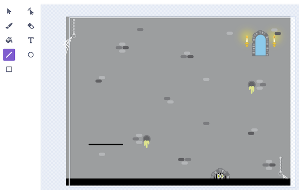

<section markdown="1">

# Platformer

These steps are available at [shorturl.at/W1Ohk](https://shorturl.at/W1Ohk).



---

</section>
<section markdown="1">

## Step 1: Remix the starter project

Open the starter project at [shorturl.at/LM268](https://shorturl.at/LM268) and click *Remix* to make your own copy.

The starter project comes with a background image and a sprite which is a knight character. You could use the knight as the character in your game or add a different sprite.

---

</section>
<section markdown="1">

## Step 2: Add a variable called *jump speed*

Click *Make a Variable* and call it *jump speed*. Untick the variable so that it doesn't appear on the screen.

Now set the *jump speed* to **0** when the game starts.


```scratch
when green flag clicked
set [jump speed v] to (0)
```

---

</section>
<section markdown="1">

## Step 3: Make the character fall to the bottom of the screen with gravity

You will create a *repeat until* loop which ends when the character reaches the door at the top-right of the screen.

```scratch
when green flag clicked
set [jump speed v] to (0)
go to x: (0) y: (-100)
repeat until <touching color (#78cdee)?>
    change y by (jump speed)
    change [jump speed v] by (-1)
end
```

---

* *How can you make gravity lower, like on the moon? Or higher, like on Jupiter?*

</section>
<section markdown="1">

## Step 4: Make the character stop falling when they hit the ground

You might have noticed that the character just keeps falling through the floor.

Inside the *repeat until* loop, add this code to make them stop when they get to the floor.

```scratch
if <<touching color (#000000)?> and <(jump speed) < (0)>> then
    repeat until <not <touching color (#000000)?>>
        change y by (1)
    end
    set [jump speed v] to (0)
end
```

---

</section>
<section markdown="1">

## Step 5: Add a block to fix the weird animation!

Now the character doesn't fall through the floor, but they gradually float up which looks a bit weird! To fix this, we put this code inside a custom block.

⚠️ **Very important**: make sure you select *Run without screen refresh* when you create the custom block. This will mean that the character moves straight up without the weird animation.

```scratch
define put on ground
repeat until <not <touching color (#000000)?>>
    change y by (1)
end
set [jump speed v] to (0)

if <<touching color (#000000)?> and <(jump speed) < (0)>> then
    put on ground
end
```

**Note**: The colour you use here will be the colour of the platforms you add in Step 10. It is important that you don't use a colour which is already in the background image. Black should work well.

---

</section>
<section markdown="1">

## Step 6: Add a variable called *on ground?*

We are going to add a variable called *on ground?*. This is going to be set to **1** if the character is on the ground or **0** if the character is jumping or falling.

After you set the *jump speed* at the start of the script, you also need to set *on ground?* like this:

```scratch
set [on ground? v] to (0)
```

And we need to update our custom block to set *on ground?* to **1**, like this:

```scratch
define put on ground
repeat until <not <touching color (#000000)?>>
    change y by (1)
end
set [jump speed v] to (0)
set [on ground? v] to (1)
```

---

</section>
<section markdown="1">

## Step 7: Make the character jump

To make the character jump, we need to add this code inside the *repeat until* loop:

```scratch
if <<key (up arrow v) pressed?> and <(on ground?) = (1)>> then
    set [on ground? v] to (0)
    set [jump speed v] to (12)
end
```

This means that the character will only jump if it is on the ground.

---

* *Can you make the character jump higher or lower?*

</section>
<section markdown="1">

## Step 8: Make the character move left and right

Next we need to be able to move the character left and right. To do this, add this code inside the *repeat until* loop:

```scratch
if <key (left arrow v) pressed?> then
    change [run speed v] by (-2)
end
if <key (right arrow v) pressed?> then
    change [run speed v] by (2)
end
```

---

* *Can you make the character look to the left or right when they are moving?*

</section>
<section markdown="1">

## Step 9: Make the character slow down

Right now, the character slides left and right like they are on an ice rink. We need to add some friction to slow the character down! 

Add this code right at the end of the *repeat until* loop:

```scratch
set [run speed v] to ((run speed) * (0.7))
```

---

</section>
<section markdown="1">

## Step 10: Add some platforms

Finally, we need to add some platforms so that the character can reach the door to complete the game. You can add them anywhere you want, but they must match the colour you used in the *touching colour* check.



---

</section>
<section markdown="1">

## Challenges

* *Can you add more levels?*

</section>
