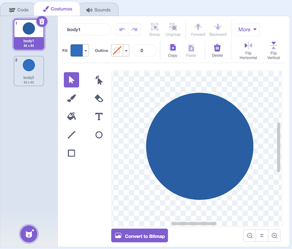
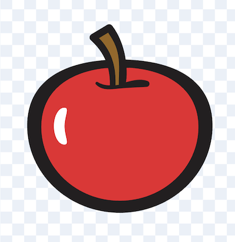

# Snake

These steps are available at [bit.ly/snake-steps](https://bit.ly/snake-steps).



<section markdown="1">

---

## Step 1: Draw a snake head sprite

Create a new sprite called "head" and have the snake head pointing to the right.


</section>
<section markdown="1">

## Step 2: Start the snake moving

```scratch
when green flag clicked
go to x: [0] y: [0]
point in direction [90]
forever
    move [5] steps
end
```

</section>
<section markdown="1">

* *Can you make the snake move faster or slower?*
* *Can you make the snake start moving in a different direction?*
* *Can you start the snake from the corner of the screen?*

---

</section>
<section markdown="1">

## Step 3: Add controls to change the direction of the snake

```scratch
when green flag clicked
go to x: [0] y: [0]
point in direction [90]
forever
    move [5] steps
    if <key (left arrow v) pressed?> then
        point in direction [-90]
    end
    if <key (right arrow v) pressed?> then
        point in direction [90]
    end
    if <key (up arrow v) pressed?> then
        point in direction [0]
    end
    if <key (down arrow v) pressed?> then
        point in direction [180]
    end
end
```

</section>
<section markdown="1">

* *Can you make it so the snake can't turn to the left if it is facing right?*
* *Can you add the same behaviour for the other three directions?*

---

</section>
<section markdown="1">

## Step 4: Draw a snake body sprite

Create a new sprite and draw a snake body. Then add another costume and draw another snake body with a different colour (VERY IMPORTANT!)



We need two different colours for the body so that we can make the hit detection work later on! The colours don't have to be completely different - two similar shades is fine.

---

</section>
<section markdown="1">

## Step 5: Add a new variable called "snake length"

First add a variable called "snake length". Next, add this code to the snake body sprite:

```scratch
when green flag clicked
set [snake length v] to (0.2)
hide
```

---

</section>
<section markdown="1">

## Step 6: 

Back in the snake head sprite, add this block at the end of your **forever** loop.

```scratch
create clone of (snake body v)
```

---

</section>
<section markdown="1">

## Step 7: 

Now inside the snake body sprite, add this code to show the first costume then the second costume:

```scratch
when I start as a clone
go to (snake head v)
go to [back v] layer
switch costume to (body1 v)
show
wait (0.2) seconds
switch costume to (body2 v)
wait (snake length) seconds
delete this clone
```

When you test the game now, you should see a 2-colour snake body following the head.

---

</section>
<section markdown="1">

## Step 8: 

Next we want to add some food for the snake to eat. You could draw some food or choose one of the existing sprites.



---

</section>
<section markdown="1">

## Step 9: 

You should create a variable called "food" and add this code to the food sprite:

```scratch
when green flag clicked
set [food v] to (0)
hide
create clone of (myself v)
```

This will hide the food, then create a clone of it (which will also start as hidden).

---

</section>
<section markdown="1">

## Step 10: 

Also in the food sprite, add this code:

```scratch
when I start as a clone
go to (random position v)
show
repeat until <<touching (snake head v)?> or <touching (snake body v)?>>
end
change [snake length v] by (0.1)
change [food v] by (1)
create clone of (myself v)
delete this clone
```

This will put the food in a random position, and when the snake eats the food, it will:

* make the snake longer,
* add 1 to the food variable, 
* create a new piece of food
* and delete the food that has just been eaten

---

</section>
<section markdown="1">

## Step 11: 

Lastly, we want the game to end if the snake touches the edge of the screen, or if it touches its own body. This is where the 2 colour body comes in handy!

Back in the snake head sprite, add this to the end of the **forever** loop:

```scratch
if <<touching (edge)> or <touching color (#086fc5)?>> then
    stop [this script v]
end
```

The colour that you select in the touching color check should be the colour of the second snake body costume.

---

</section>
<section markdown="1">

## Challenges

* *Can you add sound effects when the snake eats the food, or when the snake dies?*
* *Can you add some different food?*
* *Can you make some food make the snake go faster or slower?*
* *Can you keep track of the high score?*
* *Can you add a Game Over screen?*

</section>
