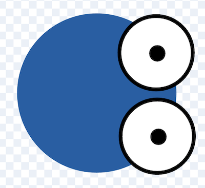

# Snake

These steps are available at [bit.ly/snake-steps](https://bit.ly/snake-steps).

<section markdown="1">

---

## Step 1: Draw a snake head

Create a new sprite called "head" and have the snake head pointing to the right.



</section>
<section markdown="1">

## Step 2: Start the snake moving

```scratch
when green flag clicked
go to x: [0] y: [0]
point in direction [90]
forever
    move [5] steps
end
```

</section>
<section markdown="1">

* *Can you make the snake move faster or slower?*
* *Can you make the snake start moving in a different direction?*
* *Can you start the snake from the corner of the screen?*

---

</section>
