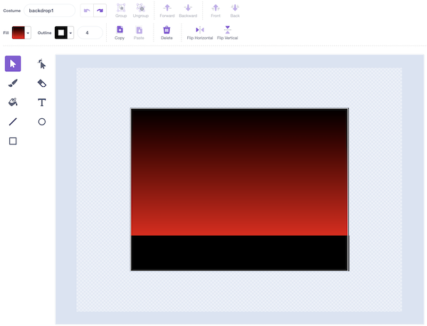
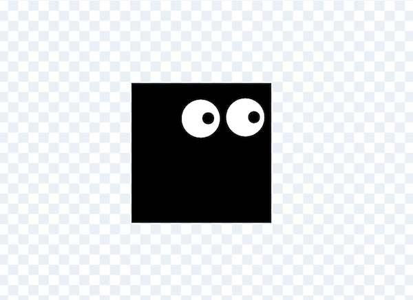
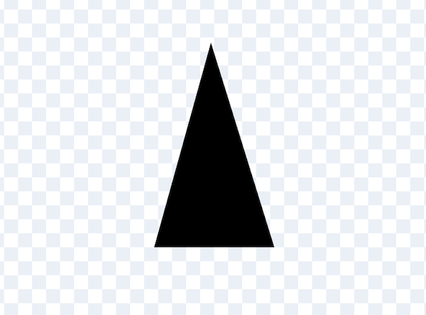
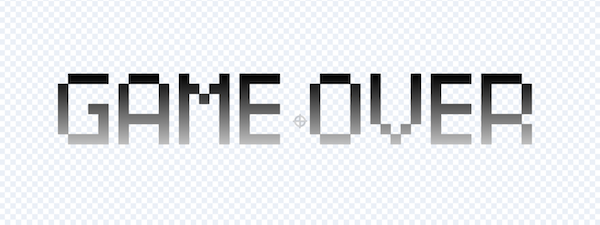

# Square Dash

## Step 1: Draw the background



---

## Step 2: Draw the player sprite



---

## Step 3: Position the player on the ground

```scratch
when green flag clicked
go to x: [-150] y: [-75]
```

---

## Step 4: Make the player jump

Add a forever loop

```scratch
when green flag clicked
go to x: [-150] y: [-75]
forever
    if <key (space v) pressed?> then
        repeat (12)
            change y by (10)
        end
        repeat (12)
            change y by (-10)
        end
    end
end
```

* Can you make the player spin do a backflip when they jump?

---

## Step 5: Draw an obstacle sprite



---

## Step 6: Create a clone

Rather than move the obstacle sprite itself, we are going to create a clone. That will allow us to have more than one obstacle on the screen at the same time. Inside the obstacle sprite add this code:

```scratch
when green flag clicked
hide
forever
    create clone of (myself v)
    wait (2) seconds
end
```

And also add this block which uses a **repeat until** to move the sprite from right-to-left across the screen. You will want to adjust the coordinates to work for your sprites and background image.

```scratch
when I start as a clone
go to x: (240) y: (-100)
show
repeat until <(x position) < (-240)>
    change x by (-10)
end
hide
```

## Step 7: End the game when the player hits the obstacle

Inside the **repeate until** we are going to add a check to see if the obstacle is touching the player. If it is, we will broadcast a **game over** message.

```scratch
when I start as a clone
go to x: (240) y: (-100)
show
repeat until <(x position) < (-240)>
    change x by (-10)
    if <touching (player v)?> then
        broadcast (game over v)
    end
end
hide
```

## Step 8: Create a game over sprite

Create a new sprite which will be displayed when the game is over. You could use the Text tool to write the words "game over".



## Step 9: Display the game over sprite

When the game starts, you should position the game over sprite in the right position and hide it.

```scratch
when green flag clicked
go to x: (0) y: (36)
hide
```

So far, nothing happens after we broadcast the **game over** message. We are going to receive it inside the game over sprite:

```scratch
when I receive [game over v]
show
stop [all v]
```

## Step 10: Count the distance travelled

Create a variable called **distance** and make sure it is ticked so it appears on the screen.


Add this new code block to the player sprite.

```scratch
when green flag clicked
forever
wait (0.1) seconds
change [distance v] by (1)
end
```

## Challenges

* High score
* Change the background colour
* Add levels and make the game get faster with each level
* Add rocket level
* Add sound effects
* Add background music
* Different obstacle sizes
* Obstacles more often
* Different types of obstacles
* Make the obstacles spin
* Make the obstacles move up and down
* Add lives
* Choose player avatar
* Animate the player (e.g. make it blink)
